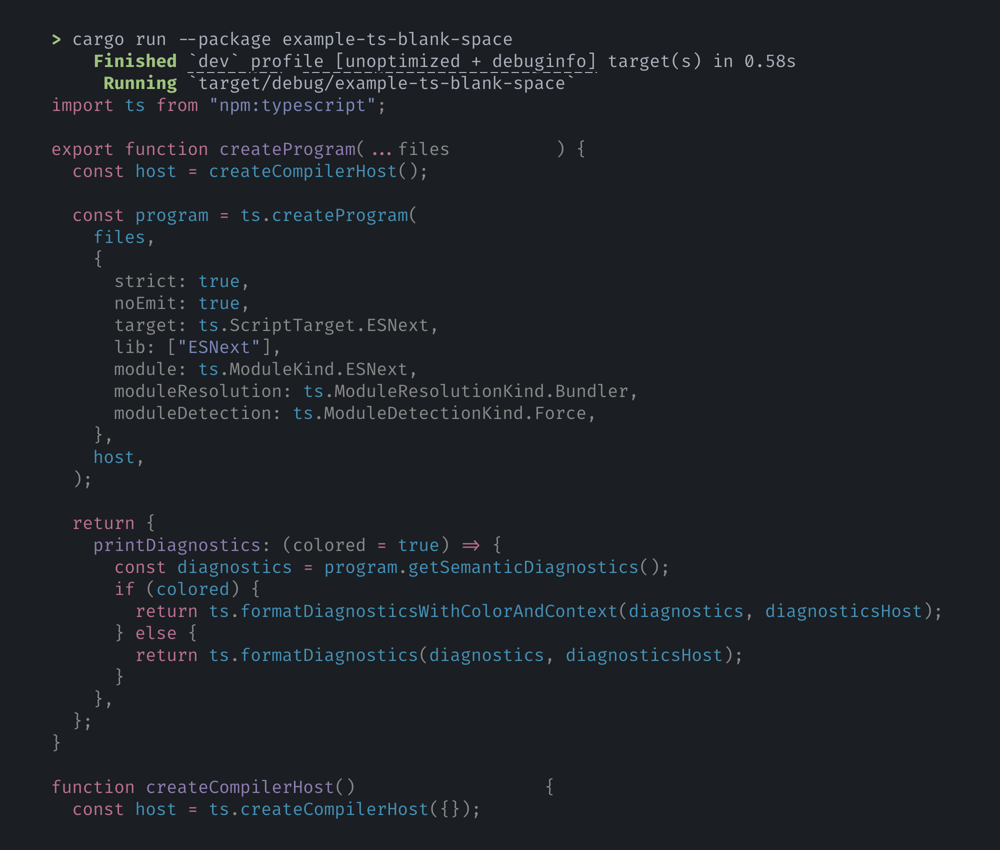

# Examples

## [_console.log_](console.md)

Introductory example using `console.log` — start from here!

## [_calculator_](calculator.md), [_fibonacci_](fibonacci.md)

Embedding ES modules for fun and portable programs.

## [_ts_](ts.md), [_ts-blank-space_](ts-blank-space.md)

Workflows integrating NPM dependencies and a bundler.

<figure>

<figcaption>

Output of the [`ts-blank-space`](ts-blank-space.md) example. Pretty-printing courtesy of
[`bat`](https://crates.io/crates/bat).

</figcaption>

</figure>
